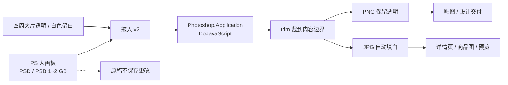
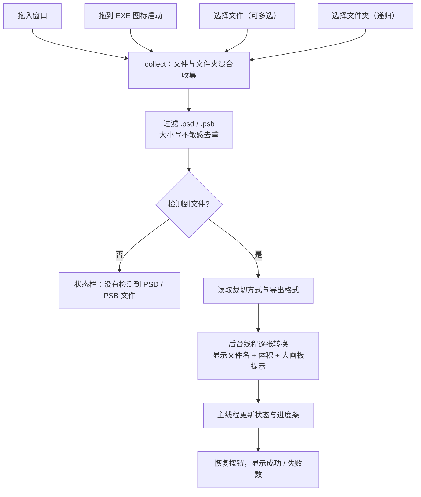
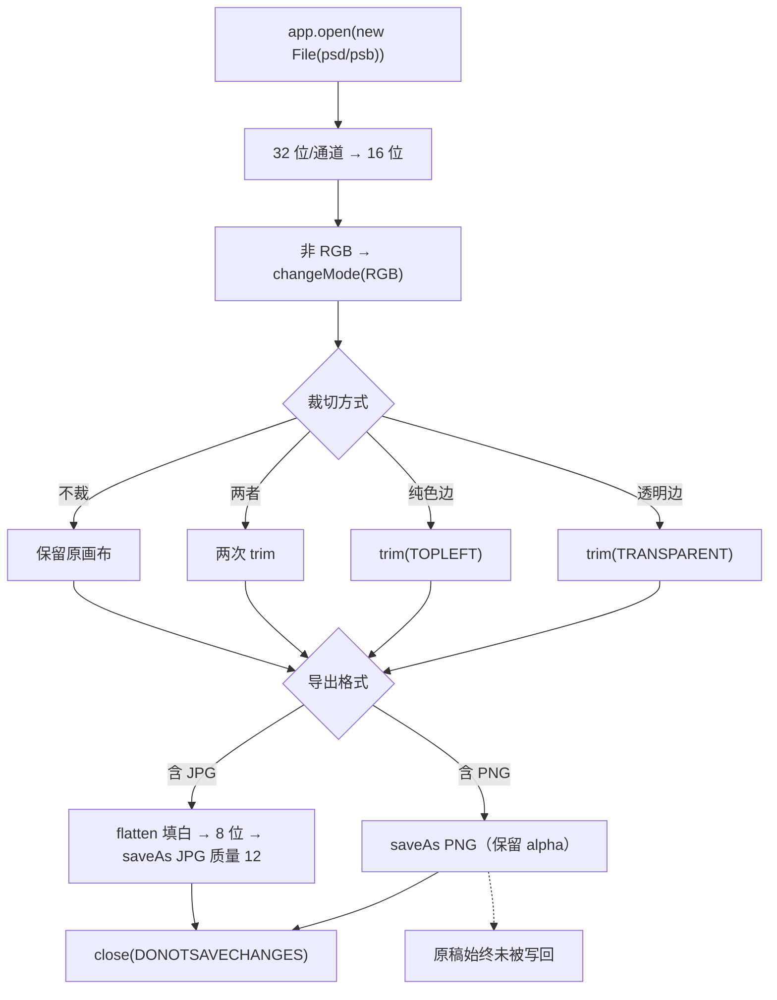
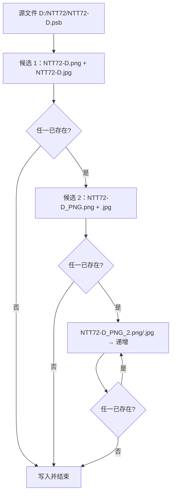

# PSD / PSB 一键转 PNG · JPG

> 大画板、四周全是留白？拖进去立即转换，默认导出完整合成 JPG 和图层名称清单，并为 PSD 补写 Windows 缩略图。

`Windows` · `Photoshop COM / ExtendScript` · `Python + CustomTkinter（v3）` · `MIT`

一个绿色小工具：把 **PSD 和 PSB（Photoshop 大型文档）批量导出成 PNG / JPG**，并且在导出前**自动裁掉画布四周的大片空白**。它不自己解析文件，而是让本机已安装的 Adobe Photoshop 打开、裁切、另存——图层、混合模式、智能对象、蒙版、色彩配置的视觉效果与你在 Photoshop 里手工操作完全一致。

## 版本

| | 程序 | 能力 |
| --- | --- | --- |
| **v3.0（当前推荐）** | [`dist/PSDTool-onedir-fixed.zip`](dist/PSDTool-onedir-fixed.zip) | 渲染 JPG 放在源文件旁；按日期显示时继承 PSD/PSB 日期；主副图逐画板与完整大图、高级 A+、拖入自动转换、稳定进度与停止 |
| v2.9 | 历史版本 | 全新现代化界面：深色模式导航、圆角设置卡片、醒目拖放区、统一按钮和进度反馈 |
| v2.8 | [`dist/PSDTool-onedir-fixed.zip`](dist/PSDTool-onedir-fixed.zip) | 同名文件策略（自动编号 / 覆盖 / 跳过）、记住导出设置、一键打开输出目录、三种工作模式卡片 |
| v2.7 | [`dist/PSDTool-onedir-fixed.zip`](dist/PSDTool-onedir-fixed.zip) | 三张顶部业务模式卡片、蓝紫配色、拖放区随模式更新提示 |
| v2.3 | [`dist/PSDTool-onedir-fixed.zip`](dist/PSDTool-onedir-fixed.zip) | **支持 .psd + .psb**、默认合成 JPG、图层名称清单、同名输出文件夹、批量拖放与大文件进度 |
| v1（原版，保留） | [`dist/PSD一键转PNG.exe`](dist/PSD一键转PNG.exe)（13 KB .NET） | 只认 .psd、不裁切、只出 PNG |

> v1 的原始二进制与逆向证据完整保留在仓库里，见 [`docs/REVERSE_ENGINEERING.md`](docs/REVERSE_ENGINEERING.md)。

---

## 你遇到的那个问题

`F:\...\NTT72\NTT72-D.psb`（1.65 GB）拖不进 v1、也导不出 PNG —— **不是文件坏了，是 v1 只认 `.psd`**：文件对话框过滤器、拖入时的扩展名判断、文件夹递归三处都写死 `*.psd`。而 PSB 是 Photoshop 在文档超过 2 GB 或 30,000 像素时自动使用的「大型文档格式」，渲染输出、大画板拼版几乎都是它。

同一个目录里就有 5 个 1~2 GB 的 `.psb`。v2 把扩展名放宽到 `.psd` + `.psb`，并按你的实际场景补了两件事：

1. **自动裁切到内容边界** —— 大画板里内容只占中间一小块、四周大量透明/白色留白时，导出的图不再带着一整圈空白。
2. **导出格式可勾选** —— 只要 PNG（保留透明）、只要 JPG（自动填白）、或两者都要；两种格式共用同一个文件名，成对出现。

---

## 30 秒上手

1. 下载 [`dist/PSDTool-onedir-fixed.zip`](dist/PSDTool-onedir-fixed.zip)，完整解压后双击 `PSDTool.exe`（无需安装、无需联网）。
2. 把 **PSD / PSB 文件或整个文件夹**拖进窗口；也可以点「选择文件」多选或「选择文件夹」递归。
3. 选择工作模式：普通渲染 JPG 保存在源文件旁；主副图画板与高级 A+ 自动建立同名文件夹。拖入后普通模式会自动开始转换。

> 更快：把文件 / 文件夹直接拖到 EXE **图标**上启动，会自动开始转换。

**前置条件**：Windows + 已安装 Adobe Photoshop 桌面完整版。详见[运行环境](#运行环境与前置条件)。

---

## 适用什么客户

| 谁 | 具体痛点 | 本工具给什么 |
| --- | --- | --- |
| **产品渲染 / 大画板拼版**（本次场景） | 一张 PS 大画板里排了多张详情图，四周留白巨大；文件动辄 1~2 GB 存成 `.psb`，普通转换工具直接不认 | 认 `.psb`，自动把画布裁到实际内容边界，一次出 PNG + JPG |
| **3D 渲染师 / KeyShot 用户** | 渲染输出、分层 PSD 要变成贴图或预览 PNG；手动另存打断渲染流程 | 一次拖放批量出图，尺寸与 alpha 原样保留（不裁切时），路径与源文件同目录 |
| **电商视觉 / 产品图团队** | 大量白底图、透明底 PSD 要批量出 PNG 上架，平台不收 PSD；同时还要一份 JPG 给详情页 | 格式可勾选，一次导出两种；输出自动避开同名，重复跑不覆盖已上架的图 |
| **设计助理 / 美工** | 重复的「打开 → 图像 → 裁切 → 另存为 PNG → 再另存为 JPG」机械劳动 | 裁切 + 双格式一次完成，进度条显示 `3/20` 与当前文件名、文件大小 |
| **摄影后期 / 修图工作室** | 客户要 PNG 预览，同时希望资源管理器显示 PSD 缩略图 | 导出修改不写回；仅补写兼容合成预览，图层与画面保持不变 |
| **独立设计师 / 小团队** | 不想为「批量转格式 + 裁边」买插件、装 Action 包或搭脚本环境 | 单 EXE、免安装、只依赖已有 Photoshop |

> 不适合：脱离 Photoshop 的服务器 / CI、macOS / Linux、AI / EPS / TIFF 等其它格式。见[能力边界](#能力边界与已知限制)。

---

## 工作流图解

### 1. 端到端：从大画板到可用的两张图


```mermaid
flowchart LR
    A["PS 大画板<br/>PSD / PSB 1~2 GB"] --> B["拖入 v2"]
    C["四周大片透明 / 白色留白"] --> B
    B --> D["Photoshop.Application<br/>DoJavaScript"]
    D --> E["trim 裁到内容边界"]
    E --> F1["PNG 保留透明"]
    E --> F2["JPG 自动填白"]
    F1 --> G1["贴图 / 设计交付"]
    F2 --> G2["详情页 / 商品图 / 预览"]
    A -.-> H["原稿不保存更改"]
```

### 2. 四种入口收敛成一条流水线


```mermaid
flowchart TD
    S1["拖入窗口"] --> C
    S2["拖到 EXE 图标启动"] --> C
    S3["选择文件（可多选）"] --> C
    S4["选择文件夹（递归）"] --> C
    C["collect：文件与文件夹混合收集"] --> D["过滤 .psd / .psb<br/>大小写不敏感去重"]
    D --> E{"检测到文件?"}
    E -- 否 --> F["状态栏：没有检测到 PSD / PSB 文件"]
    E -- 是 --> G["读取裁切方式与导出格式"]
    G --> H["后台线程逐张转换<br/>显示文件名 + 体积 + 大画板提示"]
    H --> I["主线程更新状态与进度条"]
    I --> J["恢复按钮，显示成功 / 失败数"]
```

### 3. 单张在 Photoshop 里实际发生什么


```mermaid
flowchart TD
    A["app.open(new File(psd/psb))"] --> B["32 位/通道 → 16 位"]
    B --> C["非 RGB → changeMode(RGB)"]
    C --> D{"裁切方式"}
    D -- 透明边 --> E1["trim(TRANSPARENT)"]
    D -- 纯色边 --> E2["trim(TOPLEFT)"]
    D -- 两者 --> E3["两次 trim"]
    D -- 不裁 --> E4["保留原画布"]
    E1 --> F{"导出格式"}
    E2 --> F
    E3 --> F
    E4 --> F
    F -- 含 PNG --> G1["saveAs PNG（保留 alpha）"]
    F -- 含 JPG --> G2["flatten 填白 → 8 位 → saveAs JPG 质量 12"]
    G1 --> H["close(DONOTSAVECHANGES)"]
    G2 --> H
    G1 -.-> I["原稿始终未被写回"]
```

### 4. 输出命名：成对且永不覆盖


```mermaid
flowchart TD
    A["源文件 D:/NTT72/NTT72-D.psb"] --> B["候选 1：NTT72-D.png + NTT72-D.jpg"]
    B --> C{"任一已存在?"}
    C -- 否 --> Z["写入并结束"]
    C -- 是 --> D["候选 2：NTT72-D_PNG.png + .jpg"]
    D --> E{"任一已存在?"}
    E -- 否 --> Z
    E -- 是 --> F["NTT72-D_PNG_2.png/.jpg → 递增"]
    F --> G{"任一已存在?"}
    G -- 否 --> Z
    G -- 是 --> F
```

---

## 方便什么

- **PSB 直接拖**：不用先把 1~2 GB 的大文档另存成 PSD，也不用改扩展名。
- **不用手动「图像 → 裁切」**：四周空白自动裁掉，四种裁切策略可选；不想要也能关掉。
- **一次出两种格式**：PNG 保留透明给设计/贴图，JPG 自动填白给详情页/上架，勾选即可，不用跑两遍。
- **保留分层原稿**：裁切、拼合等导出修改以「不保存更改」关闭；PSD 仅补写兼容缩略图，已有输出不会被覆盖。
- **大文件有反馈**：状态栏显示文件名、体积和 `3/20` 进度，日志逐张记录成功/失败；1 GB 以上会明确提示耐心等待。
- **中文 / 全角括号路径可用**：`F:\杨平-产品图片\01-产品图片（产品系列分类）\...` 这类路径已做转义处理。
- **零部署**：单 EXE，不用装 Python、.NET 6/8，不用联网、账号、注册表或配置文件。
- **错误说人话**：Photoshop 被占用提示「Photoshop 忙或无法读取文件」，没装提示「请先确认 Photoshop 已安装」，单张失败继续下一张。

---

## 为什么这样做

| # | 决策 | 原因 |
| --- | --- | --- |
| 1 | **调 Photoshop COM + ExtendScript，不自己解析 PSD/PSB** | 图层、混合模式、智能对象、蒙版、32 位 HDR、1~2 GB 大文档，自己写解析器必然丢效果也吃不下；让 Photoshop 本人操作才是视觉 1:1 |
| 2 | **放宽到 `.psb`** | PSB 是 Photoshop 对超大画布/超大文件的原生格式，渲染输出与拼版 commonplace；扩展名不同但 `app.open` 一视同仁 |
| 3 | `displayDialogs = DialogModes.NO` | 批处理最怕弹窗卡死：缺失字体、颜色配置文件、增效工具提示会让无人值守的转换停住 |
| 4 | **`Document.trim()` 放在保存之前** | 大画板留白在文档层面裁掉，输出的 PNG/JPG 才不会带一整圈空白；且因 `DONOTSAVECHANGES`，裁的是内存副本，磁盘原稿不变 |
| 5 | **提供 4 种裁切策略** | 透明留白用 `TRANSPARENT`、白底留白用 `TOPLEFT`、两者叠加用 `both`、完全不动用 `none`；一刀切会误裁或漏裁 |
| 6 | **格式可勾选而非固定双输出** | 有时只要 PNG 贴图，有时只要 JPG 上架；强行两个都出既费时又占盘 |
| 7 | **先存 PNG 再 `flatten()` 存 JPG** | PNG 必须保留 alpha；JPG 不支持透明，拼合时由 Photoshop 用背景色（默认白）填充，顺序反了 PNG 就没透明了 |
| 8 | JPG 前降到 8 位/通道、`quality=12` | JPG 不支持 16 位；质量 12 是 Photoshop 最高档，商品图不糊 |
| 9 | 32 位 HDR → 16 位；非 RGB → RGB | PNG 不支持 32 位浮点通道和 CMYK，不转换会直接保存失败 |
| 10 | `saveAs(..., true, Extension.LOWERCASE)` | 以副本另存、扩展名统一小写，避免 `.PNG` 在大小写敏感的引擎/CI 里读不到 |
| 11 | `finally { d.close(DONOTSAVECHANGES) }` | 无论成功失败都关闭且不保存：既保证原稿不被改，也避免批量转换后 Photoshop 里堆几十个大文档吃满内存 |
| 12 | 路径 `js_escape`（`\`→`\\`、`'`→`\'`） | Windows 反斜杠、中文 / 全角括号 / 带单引号的目录名会破坏 JS 字符串字面量，表现为「点了没反应」 |
| 13 | 每个源文件自动创建同名输出文件夹 | JPG/PNG 与图层清单集中存放，避免源素材目录散落大量导出文件 |
| 14 | 同名自动 `_PNG` / `_PNG_2` | 反复重跑、增量补图时不会把上一版成果覆盖掉 |
| 15 | 文件夹递归 + 大小写不敏感去重 | 一次选根目录覆盖整个项目；混合输入容易把同一文件计两次 |
| 16 | 后台线程转换 + 每线程 `CoInitialize()` | COM 必须在初始化过的单元里调用；大文件转换不能冻结窗口；UI 只由主线程更新 |
| 17 | 单张失败继续下一张 | 20 张里有一张被占用/损坏，不该让整批白跑 |

逐条展开见 [`docs/DESIGN.md`](docs/DESIGN.md)，v1 原始字节证据见 [`docs/REVERSE_ENGINEERING.md`](docs/REVERSE_ENGINEERING.md)。

---

## 输出规则

以 `NTT72-D.psb` 为例（默认只输出 JPG）：

| 情况 | 输出 |
| --- | --- |
| 默认首次 | `NTT72-D/NTT72-D.jpg` + `NTT72-D/图层列表.txt` |
| JPG 已存在 | `NTT72-D/NTT72-D_PNG.jpg` + 更新图层清单 |
| 勾选 PNG + JPG | 两种图片进入同一个 `NTT72-D/` 文件夹 |
| 再次重跑 | 图片自动使用 `_PNG_2` 等递增后缀，不覆盖旧图 |

- PNG 保留 alpha（透明背景）；JPG 拼合后用白底填充透明区域、质量 12。
- 裁切后画布变小，输出尺寸 = 内容边界尺寸；选「不裁切」则保持原始画布。
- `图层列表.txt` 按分组层级递归记录所有图层名称；不逐层导出图片。
- 不改动源 PSD/PSB。
- 中文、空格、全角括号、单引号路径均可处理（已转义）。

**同名文件策略（v2.8）**：渲染图片与画板模式下，「同名文件」可选三种处理——

| 策略 | 行为 | 适用 |
| --- | --- | --- |
| **自动编号**（默认） | `name.jpg` 已存在则改用 `name_PNG.jpg`、`name_PNG_2.jpg`；PNG/JPG 共用同一后缀 | 反复重跑、增量补图，绝不覆盖旧成果 |
| 覆盖 | 直接使用原路径覆盖已有图片与图层清单；不会覆盖 `.psd`/`.psb` 原稿 | 确定要刷新这一批输出 |
| 跳过 | 目标图片已存在则该张记为「已跳过」，不计入失败 | 只补缺失的图 |

高级 A+ 参考旧版文件夹模式本身即为「用新版连屏图原位更新旧分图」，属于用户明确选择参考模式后的覆盖行为，不受上方下拉框影响。

---

## 运行环境与前置条件

| 依赖 | 要求 |
| --- | --- |
| 操作系统 | Windows（Win10 / Win11）；COM + 桌面 GUI 决定它不能跑在 macOS / Linux |
| **Adobe Photoshop** | **必须已安装桌面完整版**，且 COM 组件 `Photoshop.Application` 可用 |
| v2 运行时 | 已打包进 EXE，不需要另装 Python / .NET 6/8 / VC++ 运行库 |
| v1 运行时 | .NET Framework 4.0+（Win10/11 自带 4.8） |
| 不需要 | 网络连接、管理员权限、注册表写入、配置文件 |

> **最容易忽略的一点**：工具不附带 Photoshop，也不能在没装 Photoshop 的机器上转换。这是第 1 条决策换来的准确性代价。首次使用建议先手动打开一次 Photoshop，把许可 / 初始化 / 字体等一次性弹窗处理掉。

---

## 能力边界与已知限制

- **大画板很吃资源**：1~2 GB 的 PSB 需要 Photoshop 真实加载，可能数分钟、占用大量内存与暂存盘；转换期间不要操作 Photoshop。
- **裁切依赖留白类型**：`TRANSPARENT` 只裁透明像素；**如果留白是白色/纯色而非透明，请改选「裁掉纯色边」或「先透明后纯色」**，否则看起来没裁动。这是策略差异，不是故障。
- **JPG 必然丢失透明**：这是格式本身限制，工具用白底填充（Photoshop 默认背景色）。
- **不提供 PNG 压缩 / 位深 / ICC 细调**：要精细控制请用 Photoshop 动作或另存对话框。
- **Photoshop 被占用会失败**：模态框或另一个脚本占用时 `DoJavaScript` 抛 COM 异常，提示后继续下一张。
- **未做数字签名**：PyInstaller 打包的 EXE 部分杀软可能误报；源码在 [`src/`](src/)，可自行打包核对。
- **真·多画板（Artboard）未专项验证**：工具按「一整张画布 + 四周留白」处理；若 PSD 内含多个 Artboard，建议先导出为单画布再试。
- **退出时弹 `Failed to remove temporary directory`（onefile 版）**：PyInstaller 单文件模式每次运行都要往临时目录解压，退出时删除被安全软件锁住的 DLL 就会弹这个模态框，把进程卡死。这是打包方式的问题，**不是转换失败**。根治办法是用 `--onedir` 模式（见下方[从源码构建](#从源码构建)）——目录版不解压临时文件，从物理上不会出现这个弹窗，且退出干净、启动更快。仓库里的单文件版保留给没有此问题的机器；本机已改用目录版。

---

## 从源码构建

v2 是 Python（tkinter + pywin32 + tkinterdnd2），用 PyInstaller 打包：

```bat
pip install -r requirements.txt
```

```bat
cd psd-to-png
python build_exe.py
```

产物写到 `dist/PSD-PSB一键转PNG-JPG.exe`（onefile，单文件分发用）。

**本机推荐 `--onedir`（根治临时目录弹窗）**：

```bat
python build_exe.py --onedir
```

产物是 `桌面\PSD一键转PNG工具\` 目录（内含 `PSDTool.exe` + `_internal`），然后把桌面/任务栏快捷方式指向 `PSDTool.exe`。目录版**不往 `%TEMP%` 解压**，因此不会弹 `Failed to remove temporary directory`，退出码干净为 0、启动也更快。实测 `rc=0`、`_MEI` 目录数前后不变。

> 2026-11-18 修复：窗口拖放从 `windnd` 改为 `tkinterdnd2/TkDND`，解决部分 64 位 Python/Tk 环境拖入文件时 `ucrtbase.dll / 0xc0000409` 进程级崩溃；窗口版 CLI 同时改为在无控制台时写 `%TEMP%\psdtool_cli.log`，并在 Photoshop 返回“应用程序正忙”时自动重试。

> 2026-11-19 v2.1：拖放只注册一个 TkDND 目标并明确返回复制动作，增加 `%TEMP%\psdtool_gui_error.log` 回调异常记录；界面新增“当前文件”动态进度和批量“总进度”。

> 2026-11-19 v2.2：当前文件显示“连接 Photoshop → 打开大文件 → 转换色彩/位深 → 裁切画布 → 保存 PNG/JPG → 关闭文档”的真实阶段；新增“快速预设”（不裁切、只出 JPG）和“停止队列”（当前文件安全完成后停止）。

> 2026-11-19 v2.3：默认只导出一张完整合成 JPG；每个 PSD/PSB 自动新建同名文件夹，并递归读取图层/分组名称写入 `图层列表.txt`。PNG 仍可手动勾选。

> 2026-11-19 v2.4：新增“高级 A+ 连屏切图”。可按旧版文件夹的颜色目录、文件名和尺寸，用新版连屏图批量原位更新；也支持电脑端 `1464×600`、手机端 `1200×900` 固定尺寸自动切图。

> 2026-11-19 v2.5：普通转换分为“渲染图片”和“主副图画板”模式。渲染图片默认把 JPG 放在源文件旁；主副图画板建立同名文件夹。高级 A+ 可识别“电脑端/手机端”整套项目结构，并把首页连屏对应到“第一屏1/2”。

> 2026-11-19 v2.6：工作模式下拉框统一显示“渲染图片 / 主副图画板 / 高级 A+ 连屏”三种模式；选择高级 A+ 后由主按钮打开专用窗口。JPG 文案明确标注 Photoshop `12/12` 为最高质量。

> 2026-11-19 v2.7：界面改为三张顶部业务模式卡片，统一蓝紫配色、进度条和主按钮层级；拖放区会随当前模式显示对应的输出位置与操作提示。

> 2026-11-19 v2.8：新增「同名文件」策略（自动编号 / 覆盖 / 跳过，渲染与画板默认自动编号），PNG 与 JPG 始终共用同一后缀；记住工作模式、裁切方式、导出格式、同名策略、A+ 质量与最近参考目录到 `%APPDATA%\PSDTool\settings.json`（不保存文件列表与隐私，坏设置自动回退默认）；转换完成后可一键「打开输出目录」（同目录只开一个窗口）；跳过不计入失败，日志明确标注。自检扩展到 41 项。界面同步改版：深色品牌头 + 带序号徽章的模式卡片 + 卡片式设置/进度/日志区，高级 A+ 专用窗口统一紫色主题与列表卡片。

> 2026-11-19 v2.9：主窗口迁移到 CustomTkinter 现代组件体系，采用深色侧栏模式导航、圆角设置卡片、轻量阴影层级和统一品牌色；拖放、文件选择、冲突策略、进度显示及原有三种工作模式保持兼容。打包脚本会自动收集 CustomTkinter 主题资源。

> 2026-11-19 v2.9 补充：拖入 PSD/PSB 后自动开始转换；PSD 导出时自动写入 Windows 资源管理器兼容缩略图，PSB 为避免超大文件重存不执行；新增独立品牌图标，并应用到窗口、任务栏、桌面 EXE 与侧栏品牌区。

> 2026-11-19 v2.9 画板导出优化：普通「渲染图片」只输出完整合成 JPG，不再额外生成图层名单；「主副图画板」和高级 A+ 使用独立输出文件夹，每个 Photoshop 画板或顶层分组导出一张最高质量 JPG，并以画板/分组名称命名。画板导出在同一文档内逐张处理，避免复制数 GB 文档造成 Photoshop 内存卡顿；高级 A+ 窗口加高并放大「开始转换」按钮。

> 2026-11-20 v3.0：画板模式增加导出前预检，日志显示画板/顶层分组的名称、数量与尺寸，并提示零尺寸或空分组；当前进度精确显示第几张画板。停止按钮会在当前 Photoshop 安全检查点退出，避免强制结束导致卡死或损坏工作稿；单个画板导出失败会记录原因并继续后续画板。

> 2026-11-20 v3.0 补充：修复原生 Photoshop 画板被错误导出成整张工作区的问题，输出严格使用真实画板尺寸；重名画板使用 `-2`、`-3` 编号。画板 JPG 在 Photoshop 渲染后使用质量 99、4:4:4 优化编码，显著降低高细节图片体积并保持电商交付清晰度。

> 2026-11-20 v3.0 主副图补充：主副图模式除逐画板 JPG 外，同时导出完整合成大图；名称含“整体”或“总览”的非画板分组会自动显示全部原生画板，并按所有画板的联合边界生成整体效果图，避免空白总览。

> 2026-11-20 v3.0 拖放修复：空闲时每次新拖入文件会自动替换上一次队列，只处理本次拖入内容；同一次拖入多个 PSD/PSB 仍会批量转换，避免先拖橙色、再拖蓝色时旧文件被重复处理。

> 2026-11-25 v3.0 路径与日期修复：普通渲染始终按每个 PSD/PSB 的完整源路径输出到源文件旁，并让导出图片继承源文件修改日期；资源管理器按日期分组时，源文件与导出图会显示在同一日期组。日志同步显示完整保存路径。桌面包补充显式 Tkinter/Tcl 运行时配置，避免冻结包打不开。

> 2026-11-19 v2.3：默认只输出完整合成 JPG；为每个 PSD/PSB 新建同名文件夹，并递归读取图层/分组名称写入 `图层列表.txt`。没有可裁透明边时自动跳过裁切，不影响保存。

> 注意：onedir 的程序名必须用 ASCII（`PSDTool`），中文名会让 bootloader 报 `Could not load PyInstaller's embedded PKG archive`——构建脚本里已按此处理。onefile 版仍用固定运行时临时目录 `C:\Users\Administrator\PSDToolRuntime`，避免每次在系统 `%TEMP%` 留下随机 `_MEI`。

开发态自检（不启动 Photoshop）：

```bat
python src/psd_to_png_gui.py --selftest
```

命令行批量（适合挂到脚本里）：

```bat
python src/psd_to_png_gui.py --cli "F:\杨平-产品图片\...\NTT72" --formats png jpg --trim transparent
```

`src/PsdToPng.cs` 是 **v1 原版 EXE 的行为等价重建**（C# / .NET 4.0），保留作历史参考；`src/build.bat` 可用 Windows 自带 `csc.exe` 编译它。两者关系见 [src/README.md](src/README.md)。

---

## 项目结构

```
psd-to-png/
├── README.md                          ← 本详情页
├── LICENSE                            ← MIT
├── build_exe.py                       ← v2 打包脚本（PyInstaller）
├── dist/
│   ├── PSD-PSB一键转PNG-JPG.exe        ← v2 推荐（支持 PSB / 裁切 / 双格式）
│   └── PSD一键转PNG.exe                ← v1 原版（13,312 bytes，未改动）
├── src/
│   ├── psd_to_png_gui.py              ← v2 完整源码
│   ├── PsdToPng.cs                    ← v1 行为等价重建（历史参考）
│   ├── build.bat                      ← v1 C# 编译脚本
│   └── README.md                      ← 源码说明与构建参数
└── docs/
    ├── DESIGN.md                      ← 17 条设计决策逐条展开
    └── REVERSE_ENGINEERING.md          ← v1 元数据 / 字符串 / JS 模板原始证据
```

---

## FAQ

**为什么 `.psb` 拖进去没反应？**
你用的是 v1（只认 `.psd`）。换 `dist/PSD-PSB一键转PNG-JPG.exe`，`.psd` 与 `.psb` 都支持。

**留白是白色的，默认裁不掉？**
默认「裁掉透明边」只处理透明像素。在「裁切方式」里改选「裁掉纯色边（按左上角像素颜色）」或「先裁透明边，再裁纯色边」。

**1~2 GB 的 PSB 会不会卡死？**
不是卡死，是 Photoshop 在真实加载大文档。状态栏会显示文件名与体积；请耐心等待，期间不要在 Photoshop 里点任何弹窗。内存/暂存盘不足时该张会失败并记入日志，不影响后续文件。

**会改坏我的 PSD / PSB 吗？**
不会改变图层与画面。位深、模式、裁切、拼合只发生在内存文档并以副本另存；为让 Windows 资源管理器显示预览，PSD 会用“最大兼容”写回一次合成缩略图。PSB 因文件很大不会执行这一步。

**PNG 还有透明背景吗？**
有（选「不裁切」或任意裁切策略都保留 alpha）。JPG 没有透明，会用白底填充。

**能只出一种格式吗？**
能。取消勾选另一种即可；两个都取消会提示至少选一个。

**重跑会覆盖上次的图吗？**
默认不会：自动加 `_PNG`、`_PNG_2`… 后缀，PNG 与 JPG 共用同一后缀保持成对。需要覆盖或跳过时，在「同名文件」里切换即可；覆盖也不会动 `.psd`/`.psb` 原稿。

**设置会记住吗？**
会。工作模式、裁切方式、导出格式、同名策略、A+ 质量与最近参考目录保存在 `%APPDATA%\PSDTool\settings.json`，下次启动自动恢复；不保存文件列表。设置文件损坏会安全回退默认值，不会导致闪退。

**提示「没有找到 Photoshop」？**
确认装的是桌面完整版而非看图软件；COM 组件需注册。修复安装或先手动启动一次 Photoshop 通常可解决。

**能脱离 Photoshop 用吗？**
不能，见「为什么这样做」第 1 条。改用 PSD 解析库会牺牲复杂图层效果的还原度，也处理不了 1~2 GB 的 PSB。

---

## License & 声明

[MIT](LICENSE) · Copyright (c) 2026 1187574340yangping-hash

Adobe、Photoshop、KeyShot 分别为其各自所有者的商标。本工具不随附、不修改、不分发 Photoshop，仅通过系统已注册的 COM 接口调用用户本机安装的软件；转换结果的准确性由本机 Photoshop 决定。使用本工具产生的图片请自行确认符合素材与平台规范。

v1 原始 EXE 校验值：`SHA-256 7e39aa6949d2275b3b32ab80f3951161701b017ebbc5326ef855850632dff2b5`
